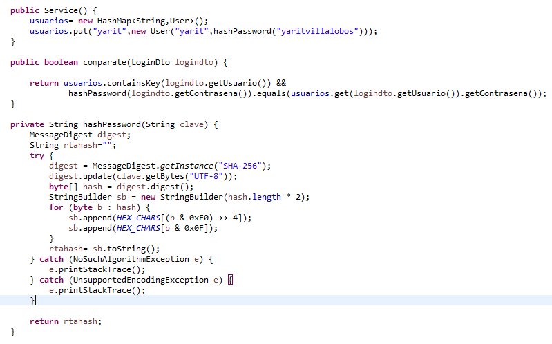
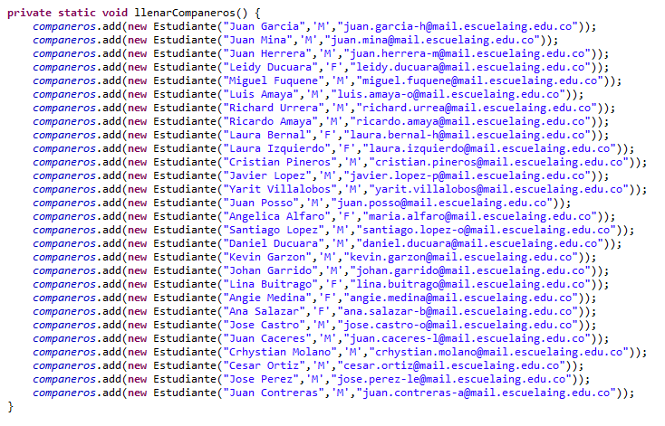

# AREP-SEGURIDAD

## Introducción

En este laboratorio se realizo:

  1. Se creó el servicio "servidorLogin" que es el encargado de hacer la autenticación del usuario.
  2. Se creó el servicio "servidorSeguro" que es el que contiene los datos que se van a mostrar, si el usuario logra autenticarse.
  3. Los dos servicios estan utilizando el protocolo https
  4. Se creo un frontend, que es donde estara el login y se mostrara los datos.
  5. Los dos servicios se encuentran en DockerHub.
  6. Se desplego estos servicios en contenedores Docker que se encuentra en una maquina virtual de EC2.
 
## ServidorLogin

Este servicio es el encargado de hacer la autenticación del usuario. Este servicio tiene un usuario guardado que es el de "yarit", y la respectiva contraseña la tiene en hash. Cuando el usuario se intenta autenticar, el servicio revisa que el usuario exista y le hace hash a la clave que coloco para ver si coinciden con la clave del respectivo usuario.

Si las credenciales son correctas, hace el llamado al servicio "servidorSeguro" para que le mande los datos, si las credenciales son incorrectoas, no llamara al servicio.

## ServidorSeguro

Este servicio tiene los datos de la aplicación en este caso los datos son los estudiantes de AREP2021-2.

## Protocolo HTTPS

Es un protocolo que permite establecer una conexión segura entre el servidor y el cliente, que no puede ser interceptada por personas no autorizadas.
Para realizar este protocolo

## DockerHub

Cada micro-servicio tiene un archivo DockerFile que se encarga de construir la imagen para poderla subir al DockerHub, el micro-servicio "connectionDB" esta en el contenedor  julitom1/connectiondb y el micro-servicio "RouteRobin" esta en el contenedor julitom1/roundrobin.

## AWS

En AWS se creo una maquina virtual y se descargo Docker, Docker-Compose y se creo un archivo docker-compose.yml que descarga los contenedores de los repositorios de dockerHub, construye las respectivas imagenes y las pone a correr en los puertos indicados en el archivo.

Para finalizar desde AWS se abrieron los puertos para que cualquiera pueda entrar.

#### Contenedores ejecutandose

#### probando puerto 45000 obtener Datos

#### probando puerto 45000 enviar Datos

#### probando puerto 45000 frontend

## Diagrama de despliegue

## Autor

Yarit Yajanny Villalobos Jimenez
